# Ecommerce-project
eCommerce Analytics Project — SQL-based analysis on retail sales data to answer business questions (traffic, bounce rate, revenue, orders) using CTEs, joins, and time filters. Includes clean queries, notes, and reproducible outputs.
## 📌 Project Overview

This repository is an **eCommerce Analytics project using SQL** to analyze performance across the full customer journey — from **traffic acquisition** to **user behavior** and finally **conversion & revenue**.

The project answers **real-world business questions** and produces metrics such as:

- **Visits, pageviews, and transactions** by month  
- **Bounce rate** and **conversion rate** by traffic source  
- **Revenue trends** by week/month, including **cumulative revenue**  
- **Revenue contribution** by device category (desktop, mobile, etc.)  
- **Purchaser vs. non-purchaser behavior** comparisons  
- **Cross-sell insights** (products also purchased together)  
- **Product-level funnel/cohort map**: *view → add_to_cart → purchase*  

The goal is to practice a complete analytics workflow: choosing the right tables/columns, joining data correctly, filtering time periods, calculating KPIs, and writing clean, reproducible SQL.

---

## 🚀 What You Will Gain

By completing this project, you will gain:

### ✅ Strong SQL Analytics Skills
- Write clean, structured queries using **CTEs**
- Apply correct **date filtering** and time grouping (**weekly / monthly**)
- Calculate key KPI formulas (**rates, ratios, contributions**)
- Build **cumulative metrics** (running totals)

### ✅ End-to-End Funnel & Cohort Thinking
- Measure performance across the funnel: **view → add_to_cart → purchase**
- Compute product-level **add_to_cart_rate** and **purchase_rate**
- Understand user behavior differences (**purchasers vs non-purchasers**)

### ✅ Business Insight & Decision Support
- Identify high-performing **traffic sources** and **devices**
- Evaluate **volume vs. efficiency** (traffic vs conversion)
- Discover cross-sell patterns for recommendation ideas

### ✅ Portfolio-Ready Deliverable
- A well-structured GitHub repo showcasing real eCommerce KPI analysis
- Clear, interview-ready examples: funnel analysis, revenue trends, and segmentation
## 📂 Dataset

This project uses **Google Analytics 360 Sample (Google Merchandise Store)** exported to **BigQuery**.  
The dataset contains **session-level data** with nested structures for **hits**, **eCommerce actions**, and **product details**.

### 🔎 Key Concepts
- **Session-level metrics** are stored in `totals` (visits, pageviews, transactions, bounces, hits).
- **Traffic attribution** comes from `trafficSource.source`.
- **Device segmentation** comes from `device.deviceCategory`.
- **Product & funnel events** (view → add_to_cart → purchase) come from `hits.eCommerceAction` and `hits.product`.

---

## 🧾 Table / Fields Description (Core Columns Used)

> Below are the main fields used across the 10 queries in this project.

| Field Name | Data Type | Description |
|-----------|----------|-------------|
| `fullVisitorId` | STRING | Unique visitor ID. |
| `date` | STRING | Session date in `YYYYMMDD` format. |
| `totals` | RECORD | Aggregate values across the session. |
| `totals.bounces` | INTEGER | Total bounces (1 if bounced session, otherwise NULL). |
| `totals.hits` | INTEGER | Total number of hits within the session. |
| `totals.pageviews` | INTEGER | Total number of pageviews within the session. |
| `totals.visits` | INTEGER | Number of sessions (1 for valid sessions, NULL if no interaction events). |
| `totals.transactions` | INTEGER | Total number of eCommerce transactions within the session. |
| `trafficSource.source` | STRING | Traffic source (search engine, referral hostname, or `utm_source`). |
| `hits` | RECORD (REPEATED) | Repeated record containing hit-level data. |
| `hits.eCommerceAction` | RECORD | eCommerce events collected during the session (hit-level). |
| `hits.eCommerceAction.action_type` | STRING | Action type: product list click (1), product detail view (2), add to cart (3), remove from cart (4), checkout (5), purchase (6), refund (7), checkout options (8),unknown (0)  | 
| `hits.product` | RECORD | Product-level data for enhanced eCommerce hits. |
| `hits.product.productQuantity` | INTEGER | Quantity of the product purchased. |
| `hits.product.productRevenue` | INTEGER | Product revenue (stored in micros; divide by `1e6` to get standard currency). |
| `hits.product.productSKU` | STRING | Product SKU. |
| `hits.product.v2ProductName` | STRING | Product name. |
| `device.deviceCategory` | STRING | Device category (Mobile, Tablet, Desktop). |
### ✅ Query 01 — Monthly visits, pageviews, transactions (Jan–Mar 2017)
### 🧾 SQL
```sql
SELECT
      SUBSTR(_TABLE_SUFFIX, 1, 6) AS month,
      SUM(IFNULL(totals.visits, 0)) AS visits,
      SUM(IFNULL(totals.pageviews, 0)) AS pageviews,
      SUM(IFNULL(totals.transactions, 0)) AS transactions
FROM `bigquery-public-data.google_analytics_sample.ga_sessions_*`
WHERE _TABLE_SUFFIX BETWEEN '20170101' AND '20170331'
GROUP BY month
ORDER BY month;
```

### 📊 Result (Screenshot)

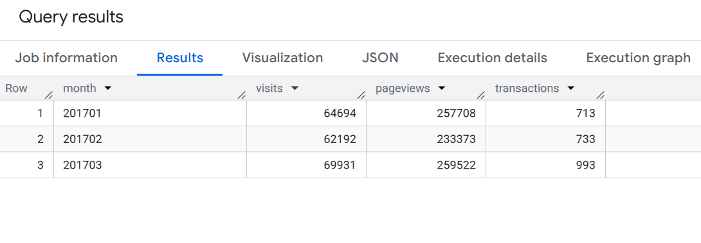

## ✅ Query 02 — Bounce rate per traffic source (Jul 2017)

**Objective:** Calculate bounce rate by traffic source in **July 2017**.  
**Formula:** `bounce_rate = num_bounce / total_visit`  
**Order:** `total_visit DESC`

### 🧾 SQL
```sql
SELECT 
    
      trafficSource.source AS source,
      SUM(IFNULL(totals.visits, 0)) AS total_visit,
      SUM(IFNULL(totals.bounces, 0)) AS num_bounce,
      ROUND(100 * SAFE_DIVIDE(SUM(IFNULL(totals.bounces,0)), SUM(IFNULL(totals.visits,0))), 3) AS bounce_rate

FROM `bigquery-public-data.google_analytics_sample.ga_sessions_*`
WHERE _TABLE_SUFFIX BETWEEN '20170701' AND '20170731'
GROUP BY trafficSource.source
ORDER BY total_visit DESC
;
```

### 📊 Result (Screenshot)
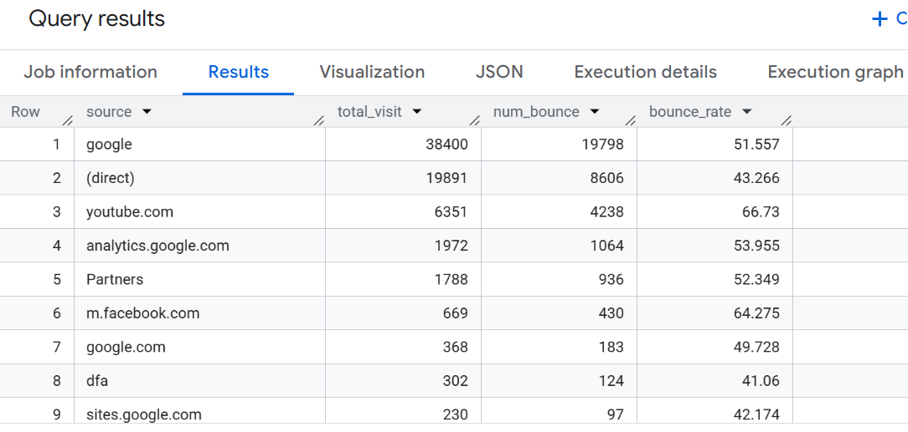

## ✅ Query 03 — Revenue by traffic source (Week & Month) in June 2017

**Objective:** Calculate **revenue by traffic source** in **June 2017**, reported at both **monthly** and **weekly** levels.

- **Time range:** 2017-06-01 → 2017-06-30  
- **Revenue note:** `productRevenue` is stored in micros, so revenue is converted using `/ 1e6`  
- **Output columns:** `time_type`, `time`, `source`, `revenue`  
- **Sorting:** `source`, `time_type`, `time`

### 🧾 SQL
```sql
-- Query 03: Revenue by traffic source by week and by month in June 2017

WITH base AS (
  SELECT
    PARSE_DATE('%Y%m%d', date) AS d,
    trafficSource.source AS source,
    p.productRevenue AS product_revenue
  FROM `bigquery-public-data.google_analytics_sample.ga_sessions_*`,
  UNNEST(hits) AS h,
  UNNEST(h.product) AS p
  WHERE _TABLE_SUFFIX BETWEEN '20170601' AND '20170630'
    AND p.productRevenue IS NOT NULL
),

month_rev AS (
  SELECT
    'Month' AS time_type,
    FORMAT_DATE('%Y%m', d) AS time,
    source,
    SUM(product_revenue) / 1e6 AS revenue
  FROM base
  GROUP BY time_type, time, source
),

week_rev AS (
  SELECT
    'Week' AS time_type,
    FORMAT_DATE('%G%V', d) AS time,   -- ISO year-week (e.g., 201726)
    source,
    SUM(product_revenue) / 1e6 AS revenue
  FROM base
  GROUP BY time_type, time, source
)

SELECT * FROM month_rev
UNION ALL
SELECT * FROM week_rev
ORDER BY source, time_type, time;
```


### 📊 Result (Screenshot)
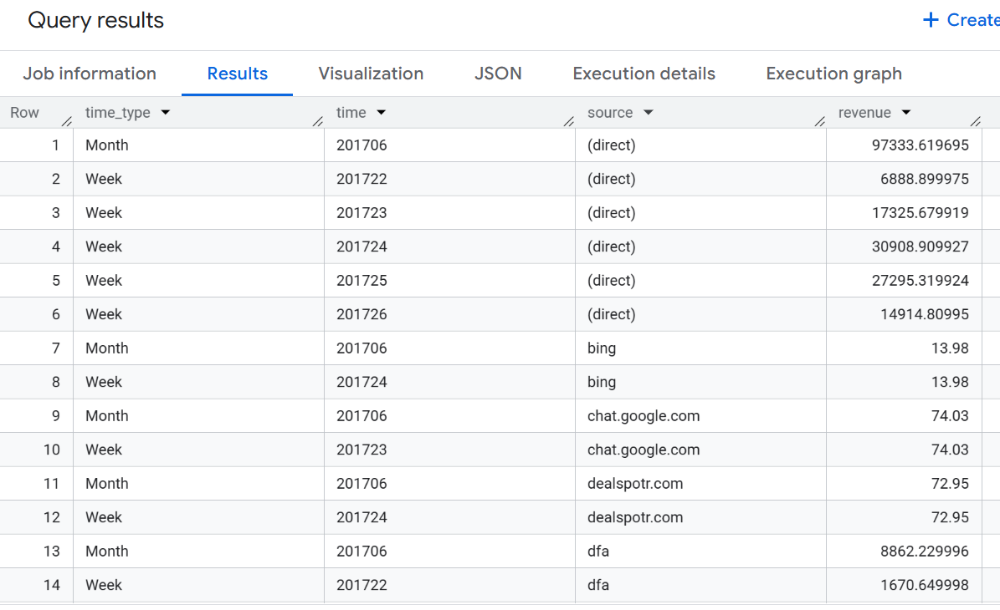

## ✅ Query 04 — Conversion rate by traffic source (2017)

**Objective:** Calculate **conversion rate** by **traffic source** for the full year **2017**.  
**Definition:** `conversion_rate = total_transactions / total_visits`  
**Order:** `conversion_rate DESC`

### 🧾 SQL

```sql
SELECT 
      trafficSource.source AS source,
      SUM(IFNULL(totals.visits, 0)) AS total_visit,
      SUM(IFNULL(totals.transactions,0)) AS transactions,
      ROUND (100* SAFE_DIVIDE (SUM(IFNULL(totals.transactions,0)),SUM(IFNULL(totals.visits, 0))),0) AS Conversion 
FROM `bigquery-public-data.google_analytics_sample.ga_sessions_*`
WHERE _TABLE_SUFFIX BETWEEN '201701' AND '201712'
GROUP BY trafficSource.source 
HAVING SUM(IFNULL(totals.transactions, 0)) >= 50
ORDER BY Conversion DESC
;
```
### 📊 Result (Screenshot)
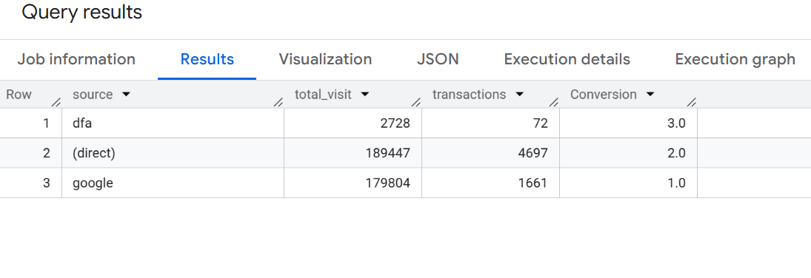

## ✅ Query 05 — Average pageviews by purchaser type (Jun–Jul 2017)

**Objective:** Compare the **average number of pageviews** between **purchasers** and **non-purchasers** in **June and July 2017**.

- **Time range:** June–July 2017  
- **Segmentation:** `Purchasers` vs `Non-purchasers`  
- **Metric:** `avg_pageviews`  
- **Expected output:** `month`, `purchaser_type`, `avg_pageviews`

### 🧾 SQL

```sql
WITH base_sessions AS (
  -- Session-level data (no UNNEST) to keep pageviews correct
  SELECT
    SUBSTR(date, 1, 6) AS month,                 -- 201706 / 201707
    fullVisitorId,
    IFNULL(totals.pageviews, 0) AS pageviews,
    IFNULL(totals.transactions, 0) AS transactions
  FROM `bigquery-public-data.google_analytics_sample.ga_sessions_*`
  WHERE _TABLE_SUFFIX BETWEEN '20170601' AND '20170731'
),

user_month AS (
  -- Aggregate to user-month level (needed for: total pageviews / unique users)
  SELECT
    month,
    fullVisitorId,
    SUM(pageviews) AS total_pageviews,
    SUM(transactions) AS total_transactions
  FROM base_sessions
  GROUP BY month, fullVisitorId
),

purchaser_users AS (
  -- Identify purchaser user-months using productRevenue 
  SELECT DISTINCT
    SUBSTR(s.date, 1, 6) AS month,
    s.fullVisitorId
  FROM `bigquery-public-data.google_analytics_sample.ga_sessions_*` AS s,
  UNNEST(s.hits) AS h,
  UNNEST(h.product) AS p
  WHERE _TABLE_SUFFIX BETWEEN '20170601' AND '20170731'
    AND s.totals.transactions >= 1
    AND p.productRevenue IS NOT NULL
)

SELECT ----- -- Avg pageviews for purchasers = total pageviews of purchaser users / # unique purchaser users
  um.month,
  SAFE_DIVIDE(
    SUM(CASE WHEN pu.fullVisitorId IS NOT NULL THEN um.total_pageviews END), 
    COUNT(DISTINCT CASE WHEN pu.fullVisitorId IS NOT NULL THEN um.fullVisitorId END)
  ) AS avg_pageviews_purchase,

 -- Avg pageviews for non-purchasers = total pageviews of non-purchaser users / # unique non-purchaser users
  SAFE_DIVIDE( 
    SUM(CASE WHEN pu.fullVisitorId IS NULL AND um.total_transactions = 0 THEN um.total_pageviews END),
    COUNT(DISTINCT CASE WHEN pu.fullVisitorId IS NULL AND um.total_transactions = 0 THEN um.fullVisitorId END)
  ) AS avg_pageviews_non_purchase
  
FROM user_month AS um
LEFT JOIN purchaser_users AS pu
  ON um.month = pu.month
 AND um.fullVisitorId = pu.fullVisitorId

GROUP BY um.month
ORDER BY um.month;
```
### 📊 Result (Screenshot)
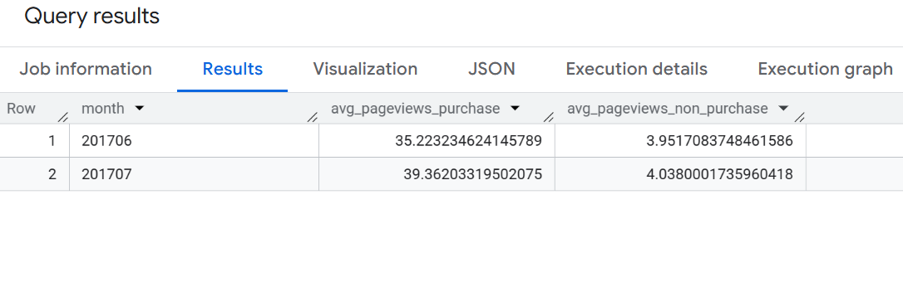

## ✅ Query 06 — Average number of transactions per purchasing user (Jul 2017)

**Objective:** Calculate the **average number of transactions per user** among users who **made a purchase** in **July 2017**.

- **Purchaser definition:** `totals.transactions >= 1`
- **Accuracy condition:** session must contain `productRevenue IS NOT NULL`
- **User identifier:** `fullVisitorId`
- **Expected output:** `month`, `avg_total_transactions_per_user`


### 🧾 SQL

```sql
WITH purchaser_sessions AS (
  SELECT
    SUBSTR(_TABLE_SUFFIX, 1, 6) AS month,
    fullVisitorId AS user_id,
    IFNULL(totals.transactions, 0) AS transactions
  FROM `bigquery-public-data.google_analytics_sample.ga_sessions_*`
  WHERE _TABLE_SUFFIX BETWEEN '20170701' AND '20170731'
    AND IFNULL(totals.transactions, 0) >= 1
    AND EXISTS (
      SELECT 1
      FROM UNNEST(hits) h
      JOIN UNNEST(h.product) p
      WHERE p.productRevenue IS NOT NULL
    )
),

user_level AS (
  SELECT
    month,
    user_id,
    SUM(transactions) AS total_transactions_per_user
  FROM purchaser_sessions
  GROUP BY month, user_id
)

SELECT
  month,
  AVG(total_transactions_per_user) AS avg_total_transactions_per_user
FROM user_level
GROUP BY month
ORDER BY month;
```
### 📊 Result (Screenshot)
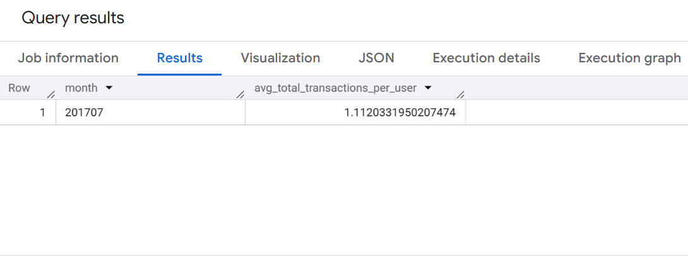

## ✅ Query 07 — Revenue contribution by device (desktop, mobile, tablet)

**Objective:** Calculate **revenue contribution** by **device category** and rank by contribution ratio (DESC).

- **Required filters:** `totals.transactions IS NOT NULL` and `productRevenue IS NOT NULL`
- **Revenue conversion:** `productRevenue` is stored in micros → divide by `1e6`
- **Ratio formula:** `ratio = revenue_by_device / total_revenue * 100`
- **Expected output:** `device`, `revenue_by_device`, `total_revenue`, `ratio`


### 🧾 SQL
```sql

WITH base AS (
  SELECT
    device.deviceCategory AS device,
    p.productRevenue AS product_revenue
  FROM `bigquery-public-data.google_analytics_sample.ga_sessions_*`,
  UNNEST(hits) AS h,
  UNNEST(h.product) AS p
  WHERE totals.transactions IS NOT NULL
    AND p.productRevenue IS NOT NULL
),

revenue_by_device AS (
  SELECT
    device,
    SUM(product_revenue) / 1e6 AS revenue_by_device
  FROM base
  GROUP BY device
),

total_rev AS (
  SELECT
    SUM(product_revenue) / 1e6 AS total_revenue
  FROM base
)

SELECT
  r.device,
  r.revenue_by_device,
  t.total_revenue,
  ROUND(r.revenue_by_device / t.total_revenue * 100, 2) AS ratio
FROM revenue_by_device r
CROSS JOIN total_rev t
ORDER BY ratio DESC;
```
### 📊 Result (Screenshot)
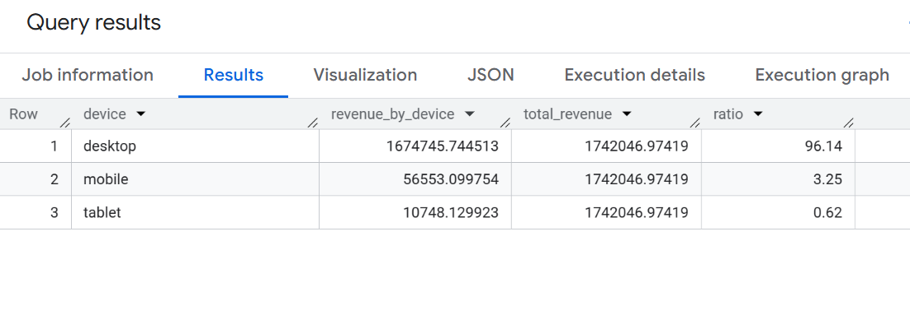

## ✅ Query 08 — Other products purchased by customers who purchased  
**"YouTube Men's Vintage Henley"** (Jul 2017)

**Objective:** Find **other products** purchased by customers who bought **"YouTube Men's Vintage Henley"** in **July 2017**, and return **product name** + **total quantity ordered**.

- **Required filters:** `totals.transactions >= 1` and `productRevenue IS NOT NULL`
- **User identifier:** `fullVisitorId`
- **Quantity metric:** `productQuantity`
- **Output columns:** `other_purchased_products`, `quantity`

### 🧾 SQL

```sql
-- "YouTube Men's Vintage Henley" in July 2017

WITH target_buyers AS (
  SELECT DISTINCT
    fullVisitorId AS user_id
  FROM `bigquery-public-data.google_analytics_sample.ga_sessions_*`,
  UNNEST(hits) AS h,
  UNNEST(h.product) AS p
  WHERE _TABLE_SUFFIX BETWEEN '20170701' AND '20170731'
    AND IFNULL(totals.transactions, 0) >= 1
    AND p.productRevenue IS NOT NULL
    AND p.v2ProductName = "YouTube Men's Vintage Henley"
),

other_products AS (
  SELECT
    p.v2ProductName AS other_purchased_products,
    IFNULL(p.productQuantity, 0) AS quantity
  FROM `bigquery-public-data.google_analytics_sample.ga_sessions_*`,
  UNNEST(hits) AS h,
  UNNEST(h.product) AS p
  WHERE _TABLE_SUFFIX BETWEEN '20170701' AND '20170731'
    AND IFNULL(totals.transactions, 0) >= 1
    AND p.productRevenue IS NOT NULL
    AND fullVisitorId IN (SELECT user_id FROM target_buyers)
    AND p.v2ProductName <> "YouTube Men's Vintage Henley"
)

SELECT
  other_purchased_products,
  SUM(quantity) AS quantity
FROM other_products
GROUP BY other_purchased_products
ORDER BY quantity DESC;
```
### 📊 Chart_Result (Screenshot)
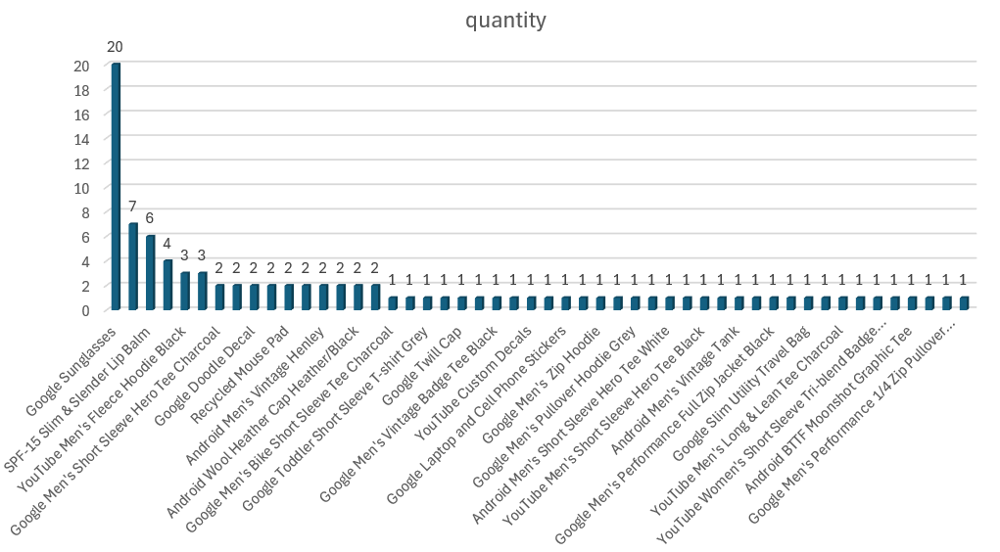

## ✅ Query 09 — Cohort/Funnel map (View → Add to Cart → Purchase) (Jan–Mar 2017)

**Objective:** Build a funnel (cohort map) from **product view → add_to_cart → purchase** for **January–March 2017**.

- **Action types:**  
  - `action_type = '2'` → Product view  
  - `action_type = '3'` → Add to cart  
  - `action_type = '6'` → Purchase  
- **Purchase validation:** only count purchase when `productRevenue IS NOT NULL`
- **Rates:**  
  - `add_to_cart_rate = num_addtocart / num_product_view`  
  - `purchase_rate = num_purchase / num_product_view`
- **Output columns:** `month`, `num_product_view`, `num_addtocart`, `num_purchase`, `add_to_cart_rate`, `purchase_rate`


### 🧾 SQL
```sql

WITH hit_level AS (
  SELECT
    SUBSTR(_TABLE_SUFFIX, 1, 6) AS month,
    h.eCommerceAction.action_type AS action_type,
    EXISTS (
      SELECT 1
      FROM UNNEST(h.product) p
      WHERE p.productRevenue IS NOT NULL
    ) AS has_revenue
  FROM `bigquery-public-data.google_analytics_sample.ga_sessions_*`,
  UNNEST(hits) AS h
  WHERE _TABLE_SUFFIX BETWEEN '20170101' AND '20170331'
),

monthly_funnel AS (
  SELECT
    month,
    SUM(CASE WHEN action_type = '2' THEN 1 ELSE 0 END) AS num_product_view,
    SUM(CASE WHEN action_type = '3' THEN 1 ELSE 0 END) AS num_addtocart,
    SUM(CASE WHEN action_type = '6' AND has_revenue THEN 1 ELSE 0 END) AS num_purchase
  FROM hit_level
  GROUP BY month
)

SELECT
  month,
  num_product_view,
  num_addtocart,
  num_purchase,
  ROUND(num_addtocart / NULLIF(num_product_view, 0) * 100, 2) AS add_to_cart_rate,
  ROUND(num_purchase / NULLIF(num_product_view, 0) * 100, 2) AS purchase_rate
FROM monthly_funnel
ORDER BY month;
```
### 📊Result (Screenshot)
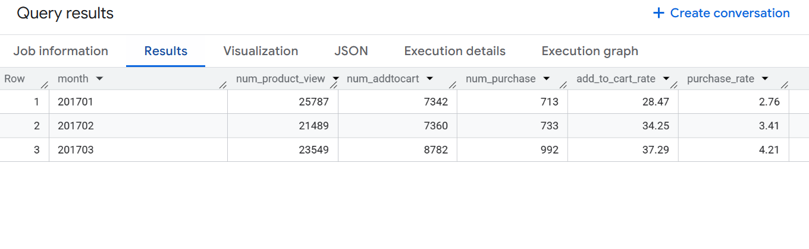

## ✅ Query 10 — Weekly revenue + cumulative revenue (May–Jul 2017)

**Objective:** Calculate **revenue by week** from **May to July 2017** and compute **cumulative revenue** over time.

- **Time range:** 2017-05-01 → 2017-07-31  
- **Filter for correct purchases:** `productRevenue IS NOT NULL`  
- **Revenue conversion:** `productRevenue` is stored in micros → divide by `1e6`  
- **Cumulative logic:** Window function `SUM(...) OVER (ORDER BY week)`  
- **Output columns:** `week`, `weekly_revenue`, `cumulative_revenue`
- 
### 🧾 SQL
```sql

WITH base AS (
  SELECT
    PARSE_DATE('%Y%m%d', date) AS d,
    p.productRevenue AS product_revenue
  FROM `bigquery-public-data.google_analytics_sample.ga_sessions_*`,
  UNNEST(hits) AS h,
  UNNEST(h.product) AS p
  WHERE _TABLE_SUFFIX BETWEEN '20170501' AND '20170731'
    AND p.productRevenue IS NOT NULL
),

weekly AS (
  SELECT
    FORMAT_DATE('%G-%V', d) AS week,     -- ISO year-week (e.g., 2017-18)
    SUM(product_revenue) / 1e6 AS weekly_revenue
  FROM base
  GROUP BY week
)

SELECT
  week,
  weekly_revenue,
  ROUND(SUM(weekly_revenue) OVER (ORDER BY week), 2) AS cumulative_revenue
FROM weekly
ORDER BY week;
```
### 📊Result (Screenshot)
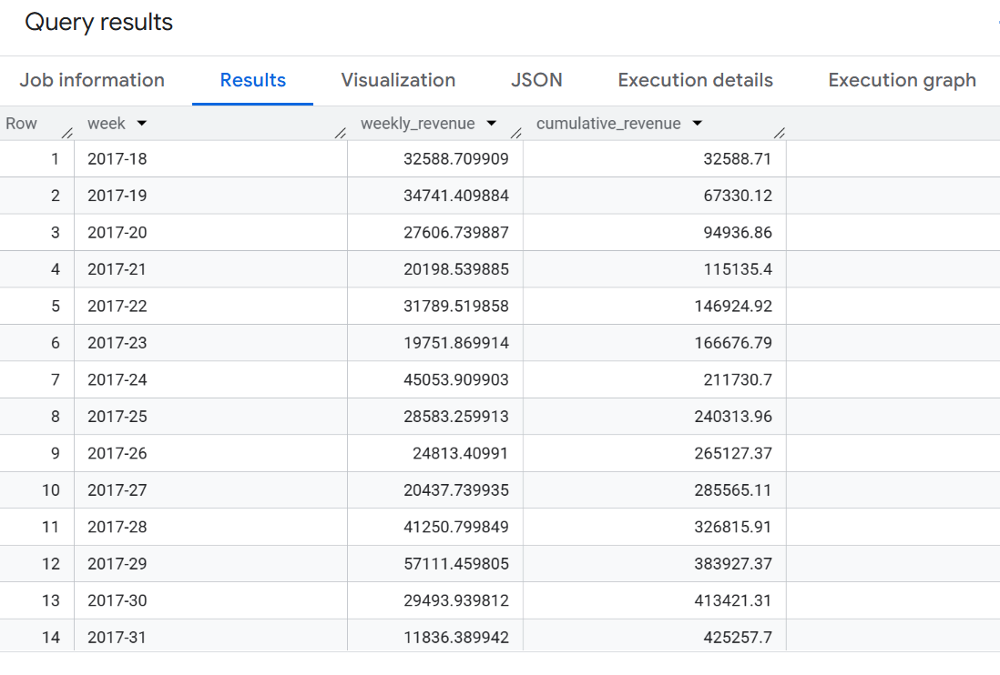

### 📊Chart_Result (Screenshot)
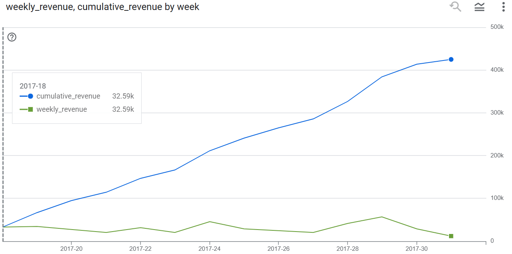


# 🧑‍💼 Son T Nguyen

Data Analyst | SQL | Power BI | Excel | Python | Data Visualization

